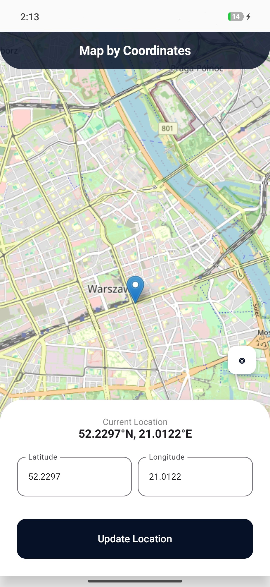

# Coor – Map By Coordinates - Mobile App

---
A sleek, coordinate-based Android application designed for precision location pinpointing. Coor bridges the gap between native Android performance and web-based mapping power, allowing users to fly to any location on Earth by simply entering its geographical coordinates.

Built with Jetpack Compose and the Leaflet.js engine, this project features a high-performance WebView integration, custom retro-themed map tiles, and a modern "floating" UI architecture.
## Visuals
---

    

## Architecture Breakdown
---
* **Hybrid Interop:** Utilizes a custom WebView bridge to communicate between Kotlin (logic/UI) and JavaScript (Leaflet map engine).
* **Asset Loading:** Leverages WebViewAssetLoader to securely serve local HTML/JS assets via a virtual https domain, bypassing modern Android security restrictions.
* **Reactive UI:** The interface is built with Jetpack Compose, featuring a layered Box layout that treats the interactive map as a living background.
* **Bidirectional Communication:** Uses evaluateJavascript to pass coordinate data from native text fields directly into the Leaflet map object in real-time.

## Tech Stack

---
* **Language:** Kotlin
* **UI Toolkit:** Jetpack Compose (Material 3)
* **Map Engine:** Leaflet.js (OpenStreetMap / Carto Tiles)
* **Web Integration:** Android WebView + androidx.webkit

## Key Features

---
* **Precision Navigation: ** Input exact Latitude and Longitude to center the map on specific global points.
* **Layered Interface:** A semi-transparent "floating" control panel that maximizes screen real estate while keeping controls accessible.
* **Hardware Acceleration:** Optimized WebView settings to ensure smooth panning and zooming on physical Android devices.
* **Input Validation:** Handles decimal coordinate inputs with dedicated numeric keyboard configurations.
## Getting Started

---
To run this project locally:

1. Clone this repository.
2. Open the project in Android Studio (Jellyfish or newer recommended).
3. Ensure you have a minimum API level compatible with Jetpack Compose and `java.time` (API 26+).
4. Build and run on an emulator or physical Android device.